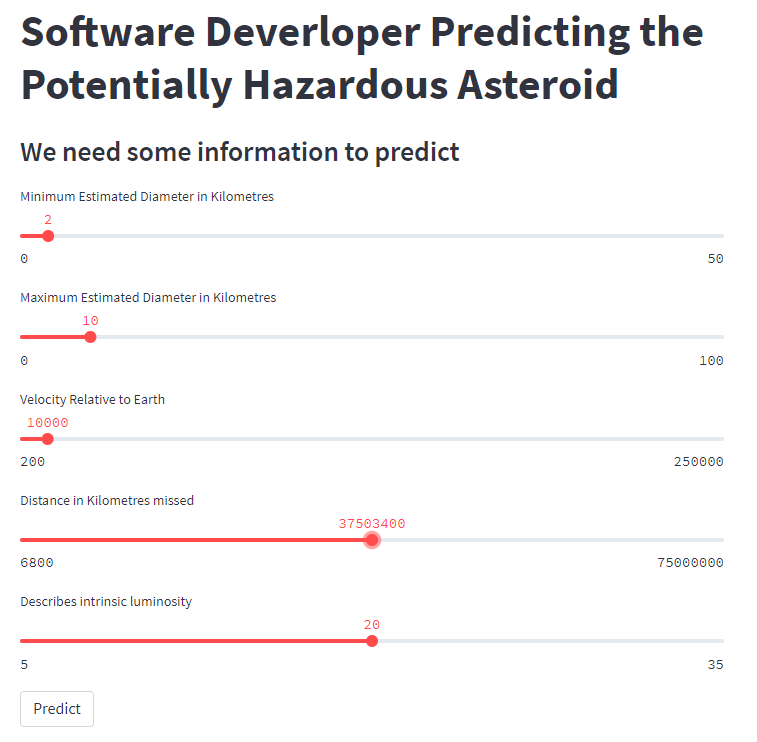

  <h1 align="center"> "Predicting the Potentially Hazardous Asteroid" </h1>

    

There is an infinite number of objects in the outer space. Some of them are closer than we think. 
Even though we might think that a distance of 70,000 Km can not potentially harm us, but at an astronomical scale, this is a very small distance and can disrupt many natural phenomena. 
These objects/asteroids can thus prove to be harmful. Hence, it is wise to know what is surrounding us and what can harm us amongst those. 
Thus, this dataset compiles the list of NASA certified asteroids that are classified as the nearest earth object.

### About Dataset

The dataset contains 90836 real world observations and 9 different attributes:
- `name`: Name given by NASA
- `est_diameter_min`: Minimum Estimated Diameter in Kilometres
- `est_diameter_max`: Maximum Estimated Diameter in Kilometres
- `relative_velocity`: Velocity Relative to Earth
- `miss_distance`: Distance in Kilometres missed
- `orbiting_body`: Planet that the asteroid orbits
- `sentry_object`: Included in sentry - an automated collision monitoring system
- `absolute_magnitude`: Describes intrinsic luminosity
- `hazardous`: Boolean feature that shows whether asteroid is harmful or not
  - False: If the asteroid is Non-hazardous 
  - True: If the asteroid is hazardous

### Model
- **Logistic Regression**
- **Naive Bayes**
- **K-nearest Neighbours**
- **Random Forest**

  <h2 align="center"> "Build Web App With Streamlit" </h2>
  

